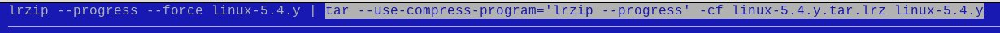

# lrzip-fe - an lrzip front-end

usage: `lrzip-fe.sh`  
Output: A command line you can cut and paste and use
Run: lrzip/lrzip-next can be run from inside the program

## About

Since working on lrzip since 2007, a goal has
always been to come up with a usable front-end for it.

As options grew, so did complexity. At first I came up with the
idea of a configuration file that would be loaded with pre-set
options at run-time. This proved very useful to those who
discovered it! But many users do not use a configuration file for
lrzip/lrzip-next.

lrzip-fe presents a series of cascading menus and choices to help
users fully explore the capabilities of:

* Compression
* Decompression
* Testing
* Info
* Change Working Directory

Thats's really all there is to lrzip/lrzip-next -- that is until you peek
under the hood.

## Thus, lrzip-fe

Version 0.9x of **lrzip-next** has 46 options. Some are mutually
exclusive, (such as `-O and -o`), other can be combined, but only
in some modes. (see file `lrzip.options.txt`)

A note on **lrzip** and **lrzip-next**  
`lrzip-fe` was designed for use with `lrzip-next`, however, it
can be used with the main branch of lrzip as well. Just don't use
options that are not available for it. At startup, it will look
for both programs with priority for lrzip-next.

lrzip-fe.sh now has the ability to present short or long options
for lrzip. Some options, such as FILTERING, only have long
options. The selection can be made on the main menu by selecting
the **Toggle SHORT/LONG Commands** button. At any point, you can
restart the choices by selecting the **Restart** button.

If an option is not selected, it is not shown.  If an option is
not selected and has a default value, the default will silently
be used (e.g. lzma compression, versus `--lzma`).  If an
**lrzip.conf** file exists, its options will be silently used
unless overridden by current option choices.

lrzip-fe can execute lrzip or tar with lrzip from any of the top
level menus. It also incrementally creates an lrzip command line
and one with tar as well. lrzip output is contained in a window.
**No error checking is done on the command line**. If a file does
not exist, or a command is not fully constructed, either `lrzip`
or `tar` will return an error.  Hopefully, lrzip-fe will enhance
your usage and understanding of lrzip.

As options are selected, the current command line for both
`lrzip` and `tar` are shown at the top of the screen using
dialog's --backtitle.

Long Options lrzip backtitle.  

Short Options lrzip backtitle.  

lrzip-fe exits displaying a screen showing both the `lrzip` and
`tar` command versions for the options selected.

Long Options lrzip command line.  

Short Options lrzip command line.  

## On tar output

The `tar` output for lrzip-fe.sh will ignore most lrzip options.
the tar output will include create, extract, list, and verbose
options. Embedded lrzip within tar will only have method, level,
filter (for lrzip >= 0.7x) and progress. The output tarfile name
will have the extension `.tar.lrz`

## Usage Examples

If `lrzip-next` is not run using the **RUN COMMAND** or **RUN TAR
COMMAND** options, a command has been constructed with
`lrzip-fe.sh`, `lrzip-next` can be executed one of three ways.
1. just cut and paste the `lrzip-next command`
2. prepend the `lrzip-next command` with `LRZIP=NOCONFIG` to ignore
   any preset options in `lrzip.conf`
3. cut and paste the `tar` command

After copying and pasting, the commandline may be edited to suit.

## About Dialog

The **dialog** program uses **ncurses**. There are certain things
to be aware of. **RETURN** select OK. **TAB** moves between
sections of a menu. **Cursor** keys moves between choices
**SPACE** selects an item within a **checkbox** or **radiolist**.
There may be some other quirks about selection.

## Acknowledgements
Con Kolivas **lrzip**
Thomas Dickey **dialog**
Andrew Tridgell **rzip**

Your comments and contributions are welcome.

October 2020  
December 2022  
Peter Hyman, pete@peterhyman.com  
https://github.com/pete4abw/lrzip-fe  
https://github.com/pete4abw/lrzip-next  
